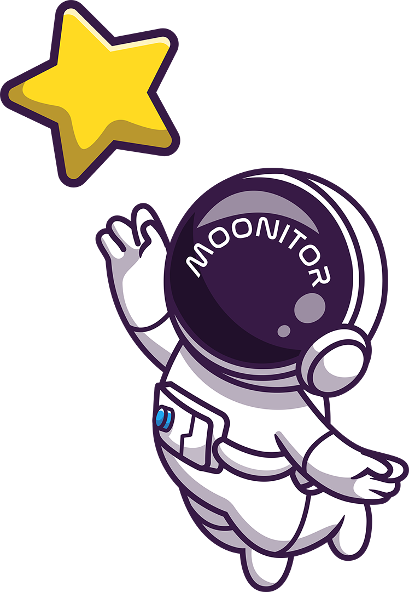

# Moonitor

Hello there!

Moonitor is an application that automates [Mood Monitoring](https://cbtwestport.com/cbt-tools-activity-mood-monitoring-and-pleasant-event-scheduling/#:~:text=In%20CBT%2C%20you%20may%20be,different%20pleasant%20activity%20lists%20online.), a technique of [Cognitive Behavioral Therapy](https://www.apa.org/ptsd-guideline/patients-and-families/cognitive-behavioral).

## What is Mood Monitoring?

Activity and Mood Monitoring is a simple but helpful skill of Cognitive Behavioral Therapy (CBT). The process is straightforward. All one needs to do is get in this routine: write down a "mood" word, assign a value to it (1-10), and jot down a quick note of what you did during that time period. There is no need to go in depth; just write down something that gets right to the point, like "Cooked dinner, ate dinner."

## Why does anyone need an app for Mood Monitoring?

The key to the process is repetition. You must get in the habit of consistently doing it, ideally once for each hour you are awake. That sounds painful but it takes very little time. Instead of carrying a pen and paper around or writing something down in a note taking app on your phone that you may lose, Moonitor, keeps all of that information in one place and prompts you to check in.

## So, what does the app do?

Well, not much yet. It is in development. That doesn't mean you can't peak under the hood soon, though! Here are some bullet points to give an idea of what Moonitor will do:

* To start, you will create an account to keep all of your mood and activity monitoring in one place for you.
* In a chat-like interface, you will be asked to pick three words you want to regularly track for your mood. 
* Next, you will be prompted with a couple of quick questions, such as "Do you want me to remind you to check in?"
* Moonitor will ask you to associate a number with your chosen words and ask you to note what you did during that period of time. There will be common activity tags available that will allow you to populate the information without typing. You will see options like "Slept," "Ate," "Went for a walk," "Watched TV," and so on. The app will get to know you too and add other tags that you use the most.
* If you say you would like to be reminded to check in, you will receive an email at whatever interval you choose (i.e. daily, hourly, twice a day, etc.). Browser notifications will likely be an option as well. Down the road, it may be a native mobile app.

So, you rate the words picked to monitor your mood, and click/type in any activities you did. That's pretty much it! 

## Is that really it, though?

Nope! As Moonitor gets to know you, it will be able to provide you with information showing you historical trends that can be filtered into different views. You will be able to prompt Moonitor to answer questions for you, such as "Graph my mood ratings over the last month", "Do I get a case of the Mondays?", or "How did I feel this same time last year?" 

The goal is to get Moonitor to grow with you to make sure you are living your best life.

## OK, sounds good. So, I can peak under the hood?

Sure. Well, soon. As more data gets pushed to this repository, you will be able to mo(o)nitor the progress. Once it is up and running, Moonitor will live [here](https://moonitor.allora.group/), at least temporarily.

If you're curious about the stack, it will likely consist of some combination of Vue.js/Nuxt.js, Vuetify or Bootstrap, Node.js, Express, a NoSQL database, and a lot of late nights spent coding. 

As far as stacks are concerned, MEVN rolls right off the tongue, doesn't it?

## What's next, then?

Well, I should probably start by washing the dry erase marker smudges off my pinkie. Oh, the curse of the lefty. 

Whiteboarding will continue, as will the research. Next up is prototyping and building out specs. Once the application is ready to review, it will be sent out to some people I know will try their hardest to break it -- which would be greatly appreciated! It might go through a couple of iterations of this before it is ready for public consumption.

## WHy are you doing this?

Historically speaking, I am a LAMP guy. That stack has treated me well over the years and I enjoy working in it. Some things do vary now, though. For instance, I heavily prefer Azure SQL over MySQL. 

I have been in an environment where public repositories were not an option (and understandably so) and I do not have much to show on GitHub. It is about time I put something out into the world that showcased what I could do.

When I asked myself what I should build, I assumed I would do a small project like rebuilding some website popular website in a modern framework; really, just anything that would check some boxes. I did not plan on building out an application like this but I see a lot of value in it both at personal and professional levels.

## Are there apps out there that do stuff like this?

My blunt answer is that I don't care. I am not trying to compete with anything you would currently find in the app store. I want to work with a CBT therapist to create something that would benefit people and leave it as open source code for anyone who wants to add onto it or make something better out of it. I want to put a little seed out into the world that hopefully will grow into something much larger, not in terms of stars or downloads but in ways that can help people. I truly hope this does.

### Credits

[catalyststuff](https://www.freepik.com/free-vector/astronaut-catching-star-cartoon-vector-icon-illustration-science-technology-icon-concept-isolated-premium-vector-flat-cartoon-style_16844015.htm#query=astronaut&position=24&from_view=search&track=sph) is the creative force behind the astronaut images

The background image came from [Freepick](https://www.freepik.com/free-vector/falling-stars-beautiful-night-background_5376553.htm#page=2&query=space&position=18&from_view=search&track=sph).